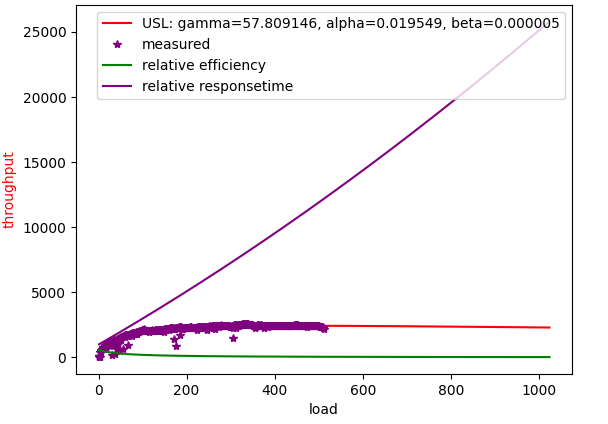
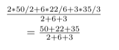

Discrete Concurrency Library
===========================

Formal queueing theory has some interesting insights, but trying to extract a model out of a real system is problematic.
Measuring service times directly is hard.  Simply instrumenting a simulation, or
measuring a real system are useful approaches to extracting insights.

If instead, you can simply supply task measurements, in a similar fashion to Spans (Prometheus counter and gauge),
it is possible to get visualizations and measurements from the data.  One of the more interesting
measurements is the Universal Scaling Law.

- Get a scatter plot of load versus throughput.
- With the given points in the scatter plot, average throughput as a function of load should be enough to curve fit to the USL
- A curve fit to the USL will allow a forecast of where the service stops increasing throughput when it is given more load to handle.
- Comparing the USL to linear scaling gives a direct efficiency measurement.  Given that the costs go up linearly with the number of servers handling the load, it can be calculated not only what is the maximum throughput that is possible, but at what point it is too expensive to buy minor gains in throughput.
- The USL curve implicitly measures contention, which ends up being waiting in queues.  We can use this information to calculate latencies.
- The USL curve implicitly measures coherence (cross-talk), which is caused by having to come to agreement with a percentage of all existing servers.  Coherence not only limits throughput, but it can cause adding more resources to actually decrease total throughput.  This should be familiar to anybody that works in an organization that grows from small to large. 


Which should fit curves like this, where you either get linear scalability, Amdahl's law (scalability limited by queueing), or scalability ruined by coherence.


Which is governed by this equation, detailed in papers such as this one [https://cdn2.hubspot.net/hubfs/498921/eBooks/scalability_new.pdf](https://cdn2.hubspot.net/hubfs/498921/eBooks/scalability_new.pdf)


For this task.  Note that I don't simulate with sleeps, because that won't consume resources; because sleeping looks like it scales linearly because it's not doing any work.
(ie: DONT simulate loads by sleeping!  Sleeping scales much better than real work!)
Instead, there is a shared queue to create some contention.  There appears to be natural cross-talk in just scheduling goroutines.

```go
func schedTest(m *Metrics) {
        sharedBottleneckQueue := 16
        concurrentRequests := 512
        ch := make(chan int, sharedBottleneckQueue)
        wg := sync.WaitGroup{}
        for i := 0; i < concurrentRequests; i++ {
                wg.Add(1)
                go func() {
                        for j := 0; j < 4; j++ {
                                runtime.Gosched()
                                start := ns()
                                tasks := Count(rand.Intn(1000))
                                for l := 0; l < int(tasks); l++ {
                                        ch <- 5
                                        runtime.Gosched()
                                        _ = <-ch
                                }
                                finish := ns()
                                m.Add(start, finish, tasks)
                                runtime.Gosched()
                        }
                        wg.Done()
                }()
        }
        wg.Wait()
}

func main() {
        m := NewMetrics()
        m.StartObserving(ns())
        schedTest(m)
        m.StopObserving(ns())
        m.Calculate().ThroughputAtLoad().Write()
}
```

A static test of the API would be more like this:

```go
        ...
        m := NewMetrics()
        m.StartObserving(5)
        m.Add(10, 20, 22)  // start at 10, stop at 20, 22 things done
        m.Add(20, 40, 20)
        m.Add(15, 45, 33)
        ...
        m.StopObserving(1000)
        m.Calculate().ThroughputAtLoad().Write()
```

The prediction of a curve fit is pretty good:



By contrast, see Eben Freeman's YouTube talks on this topic .  These diagrams that show the waiting times happening explain it really well.
But the slope at which remaining work goes to zero is equivalent to knowing the service time of a service.  If you make up a model to study it, this is no problem.
But if you take measurements, some of these parameters are hard to fit. 


An interesting talk from where these diagrams come:

[https://youtu.be/Hda5tMrLJqc?t=2](https://youtu.be/Hda5tMrLJqc?t=2)

Preliminaries:
================

- A span is a measurement put in when a task reports progress:  `(start, stop, count, load)`, where `load==1` for observing counts going up or `load==0, count==0` for simply ensuring that all time is accounted for when measurements are being taken.
- `start` is int64.
- `stop` is int64.
- `count` could be int64 or float64.  I currently use int64.  A `count` should be greater than or equal to zero.
- `start < stop`, so that there are no zero-length intervals.  It is up to you to choose units such that happens conveniently.

When a system is under observation:

- The fraction of _observed_ time in which it has load greater than zero, is Utilization.  For jobs serviced against a CPU, this would be CPU utilization, a number from 0 to 1.
- We need to keep _unobserved_ time out of metrics.  That means that we need to note when observation actually begins and ends.
- The correct _weighted_ average is the total `count` divided by the total duration `(stop - start)`.  When you have concurrency, it's even more subtle than this.  There is the total duration of time for tasks that may overlap in time (the throughput you would have if there were no concurrency at all - what the datacenter is concerned with, because it's related to power consumption), versus total clock time (for the concurrently sped-up throughput - what the user is concerned with, because it's related to the performance observed by a user, regardless of what other users are seeing).  Keep a running total of both separately.  You cannot take averages of averages, as this will not weight them correctly.
- The `count/(stop - start)` is the rate at which the counter increases.

Note that:

- If we only report the rate, without the duration, we have no idea by how much the count increased over the duration
- If we only report the rate and duration without a `start` time, then we cannot properly calculate _overlaps_ in the data.  Overlaps are the heart of concurrency and queueing.
- We want properly weighted averages.  The rate reported cannot be separated from its duration.

Example:

An unweighted mean implies that all the time intervals were the same.  But the unweighted case is a special case of the weighted case.


It happens to be that what you really want to do is to just sum the counts in one counter, and observation time of the counts in another counter.  Only divide them when you are asked for a rate later.



To see why, imagine the weighted average is for getting throughput of these events:

- 50 events in 2 seconds
- 22 events in 6 seconds
- 35 events in 3 seconds

Seeing 25 events in 1 second, twice is the same as seeing 50 events in 2 seconds.

If these events did not overlap in time, then the actual throughput should be the sum of total events divided by total observation time for them.
In this case, it would be 107 events in 11 seconds, for a throughput of 107/11.

However, we must make the distinction when there is concurrency (the whole point of this library).

- Assume that all three events started at time 0.  Before time 0, load is 0, at 0 events per second.
- For 0 to 2 seconds we have `50/2 + 22/6 + 35/3` events per second happening, at load 3.
- Then from 2 seconds to 3 seconds, we are at load 2 throughput of `22/6 + 35/3` events per second.
- From 3 seconds to 6 seconds, throughput is `35/3` events per second at load 1.
- From time 6 and into the future, it's load 0 with 0 events per second.  

This is the reason that this library reports spans as a count over a time interval.  It is crucial to have `start` to calculate overlaps.  Otherwise, load and throughput would need to be reported independently; and most likely, inconsistently.

The goal is an object that has an accurate API like:

- `metrics.StartObservation(start)` to begin including all time, including idle time, in calculations.
- `metrics.Add(count, stop, start)` add in observations.  This should happen while observation is actually started to properly include idle time.
- `metrics.StopObservation(stop)`  stop collecting data.
- `metrics.Calculate().ThroughputAtLoad()` function to calculate throughput at observed loads.

Since a count is reported after it stops, we must be able to report data out of order.  
The whole problem with concurrency is that concurrent tasks happen in arbitrary order relative to each other, subject to scheduling.
Typically, the units for `start` and `stop` would be such that `start` and `stop` for a `count` can never be the same.  UnixNano should be fine for this.

- The units of counter rates `count/(stop - start)` is in `count/time`.  To properly average these, the `count` and `duration` must be _independently_ summed, and the weighted average taken as `totalCount/totalDuration`.
- With properly weighted averages, we have a way to start calculating statistical items of interest, such as standard deviation.

Insights
============

An algorithm to handle this correctly would:

- Periodically turn each reported span `(start, stop, count, load)` into a statistical report.
- We cannot just sort the spans by `start`, because there are overlaps due to `stop`; and it is these overlaps that are the whole point of the measurements.
- So, simply process the spans by inserting into a NEW data structure that inserts the span TWICE, once for `start` and once for `stop`, at clock time `at`.
- Sort the whole thing by these `at`.  The `load` is accumulated for each `at` as a running total, with `start==at` being to add it, and `stop==at` being to subtract it.
- Including `count` is more complex.  We are really dealing with a rate rather than the actual count.  We want to increment throughput (ie: rate) by `counter/(stop-start)` when `start==at`, and decrement when `stop==at`.  Within floating poing errors, the throughput and `load` should be back to exactly zero after iterating over all reported spans.
- Note that `at` will be duplicated.  A single `at` entry that accumulates rate and `load` should be made to remove duplicated `at`.

Given this, we have a sequence of `(at, throughput, load)`, where the graph `(load, throughput)` is what we need to fit to the USL.

This should completely characterize the measured scalability.  It tells us how much concurrency (load) was actually handled, with the ratio of `load/throughput` at any time being how efficiently resources are being used to handle the load. 

